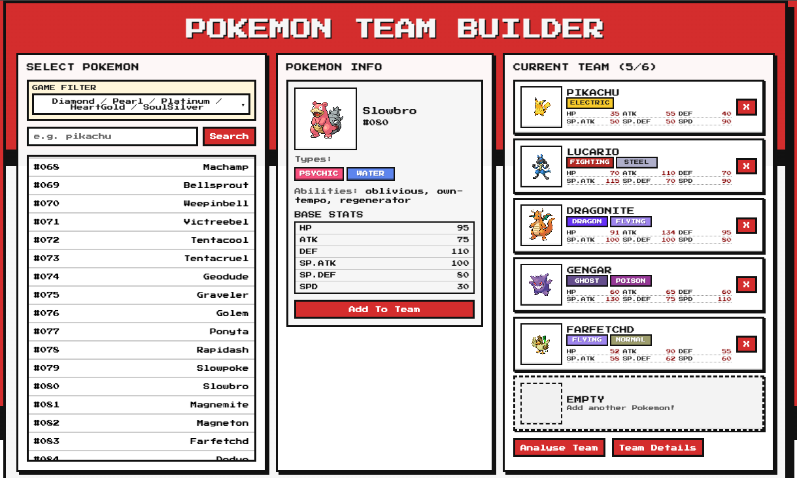
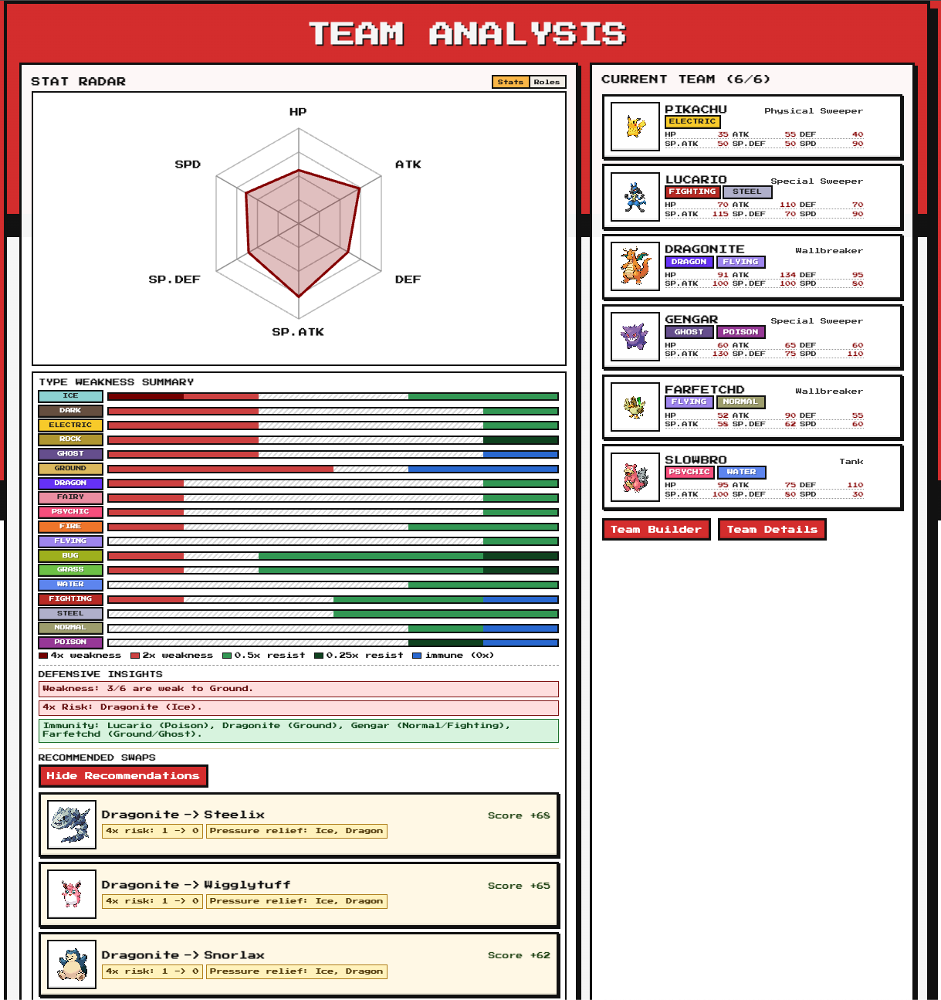
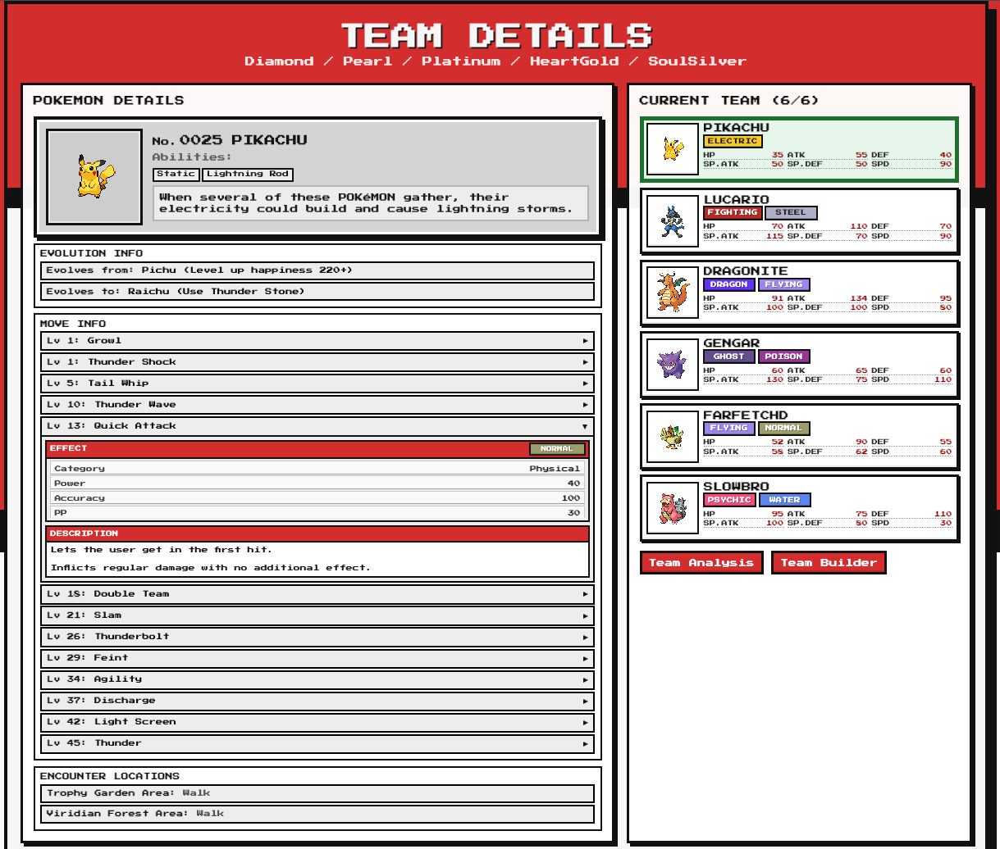

# Pokemon Team Builder

A casual-playthrough Pokemon team builder for players progressing through the main games. Build a team, inspect Pokemon details, analyse weaknesses, and get defensive swap suggestions without focusing on competitive meta optimisation.

## User Guide

### What This App Is

Pokemon Team Builder is a web app with three core pages:

- Team Builder: search, view, and add Pokemon to your team.
- Team Analysis: view stat/role balance, defensive type weaknesses, and swap recommendations.
- Team Details: inspect deeper data for team members, including evolution links, level-up moves, and encounter locations.

### What You Can Do

- Build and manage a 6-member team.
- Search Pokemon by name and view base stats, types and abilities.
- Filter Pokemon by supported games.
- Analyse team type pressure and role profile.
- Get defensive swap suggestions from your current team context.
- View more detailed info about evolutions and moves from the Team Details page.

### How It Works for Users

1. Pick a game filter in Team Builder.
2. Add Pokemon to your team.
3. Open Team Analysis for weakness summary, stat/role radar chart, and recommendations.
4. Open Team Details for evolution info, move info, and encounter locations.
5. Expand move rows to load full move details when needed.

### 1. Team Builder

What you can do:

- Search Pokemon by name.
- Add and remove team members (up to 6).
- Select a game filter to scope available Pokemon.
- View a Pokemon's quick detail card before adding.

#### Game Filter Behavior

- All obtainable Pokemon (through catching, trading, events, or transfers) within the selected game is displayed.
- Recommendations and Team Details are filter-aware.
- If a team Pokemon is outside the selected filter scope, recommendations or details might not work properly.

### 2. Team Analysis Page

What you can do:

- View your team's role distribution and stat profile in a radar chart.
- Review defensive type pressure and uncovered matchup risks.
- See defensive recommendations generated from available candidates.

How role analysis works (roughly):

- Each Pokemon receives a score for each role from base stats (HP, ATK, DEF, SP.ATK, SP.DEF, SPD).
- The highest role score is used as that Pokemon's primary role.
- Team-level role distribution is then aggregated across all selected team members.

Main role traits used by the model:

| Role             | Main traits                                | Usually weaker traits          | Typical purpose               |
| ---------------- | ------------------------------------------ | ------------------------------ | ----------------------------- |
| Physical Sweeper | High ATK + high SPD                        | DEF, SP.DEF                    | Fast physical damage pressure |
| Special Sweeper  | High SP.ATK + high SPD                     | DEF, sometimes ATK             | Fast special damage pressure  |
| Physical Wall    | High DEF + high HP                         | SPD, often SP.ATK              | Soak physical hits            |
| Special Wall     | High SP.DEF + high HP                      | SPD, often ATK                 | Soak special hits             |
| Tank             | Balanced HP/DEF/SP.DEF with usable offense | Usually lower SPD              | Absorb hits and trade back    |
| Wallbreaker      | Very high ATK or SP.ATK                    | Speed and/or bulk can be lower | Break bulky opponents         |
| Fast Support     | High SPD with useful utility profile       | Raw attacking stats            | Tempo and utility first       |

Rough score tabulation approach:

- Scores are weighted combinations of relevant base stats per role (for example, sweepers weight offense + speed, walls weight bulk stats).
- Penalties are applied when a role's non-priority stats are too low for that role profile.
- The radar and team role summary are built from the per-Pokemon role assignments and score spread.
- This is a practical heuristic for casual playthrough guidance, not a competitive simulator.

### 3. Team Details Page

What you can do:

- Click team members to load detailed data.
- Traverse evolutions by clicking evolution entries.
- Expand move rows to fetch and display full move details.
- View location encounters scoped to your selected game filter.
- Inspect ability and move descriptions through the dropdown menu.

### Run Locally

From the project root:

1. `npm install`
2. `npm run dev`

Local URLs:

- Frontend: http://localhost:5173
- Backend: http://localhost:4000
- Health: http://localhost:4000/health

### Run with Docker

From the project root:

1. `docker compose up --build`

Services:

- Frontend: http://localhost:5173
- Backend: http://localhost:4000

Stop services:

1. `docker compose down`

### Screenshots

Team Builder:



Team Analysis:



Team Details:



## Technical Implementation Overview

### Tech Stack

- Frontend: React + Vite
- Backend: Node.js + Express
- External API: PokeAPI
- Styling: CSS

### Architecture

- Frontend calls backend through /api routes.
- Backend aggregates and normalises PokeAPI responses.
- Both layers apply caching to reduce repeated work.
- Team Details uses progressive loading for faster first render.

### Project Structure

High-level layout:

```text
pokemon-team-builder/
├─ backend/
│  ├─ index.js
│  └─ src/
│     ├─ routes/pokemon.js
│     └─ services/
│        ├─ pokeapi.js
│        └─ defensiveRecommendations.js
├─ frontend/
│  └─ src/
│     ├─ pages/
│     │  ├─ TeamBuilderPage.jsx
│     │  ├─ TeamAnalysisPage.jsx
│     │  └─ TeamDetailPage.jsx
│     └─ features/
│        ├─ team-builder/api.js
│        └─ team-detail/components/TeamPokemonDetailPanel.jsx
└─ scripts/dev-runner.js
```

Purpose of key files:

- backend/index.js
  - Starts the Express server, wires middleware/routes, and triggers warm-cache work at boot.
- backend/src/routes/pokemon.js
  - Defines API route handlers and request validation/parsing for Pokemon-facing endpoints.
- backend/src/services/pokeapi.js
  - Handles PokeAPI fetches, response shaping, cache reads/writes, and game-availability-aware detail assembly.
- backend/src/services/defensiveRecommendations.js
  - Computes team defensive analysis and ranks replacement candidates for defensive swaps.
- frontend/src/pages/TeamBuilderPage.jsx
  - Main team construction workflow (search, select, filter, and current team actions).
- frontend/src/pages/TeamAnalysisPage.jsx
  - Renders role/type analysis outputs and recommendation panels.
- frontend/src/pages/TeamDetailPage.jsx
  - Orchestrates selected team member detail loading, evolution navigation, and prefetch behavior.
- frontend/src/features/team-builder/api.js
  - Frontend API client layer with request caching and normalized helper methods.
- frontend/src/features/team-detail/components/TeamPokemonDetailPanel.jsx
  - Detailed UI panel for moves/evolution/encounters, including lazy move detail loading.
- scripts/dev-runner.js
  - Runs and supervises local frontend/backend dev processes from one command.

### Backend Endpoints

```http
GET /health
GET /api/ping

GET /api/pokemon?search=&limit=&offset=&gameFilterKey=
GET /api/pokemon/:nameOrId
GET /api/pokemon/:nameOrId/team-detail?gameFilterKey=&includeMoveDetails=
GET /api/pokemon/moves/:moveName

GET /api/pokemon/defensive-candidates?weakTypes=&excludeIds=&limit=&scanLimit=&gameFilterKey=
POST /api/pokemon/team-defense-analysis
POST /api/pokemon/defensive-swaps
```

Endpoint purposes:

- GET /health
  - Lightweight health probe for uptime/readiness checks.
- GET /api/ping
  - Simple connectivity check between frontend and backend.
- GET /api/pokemon?search=&limit=&offset=&gameFilterKey=
  - Returns searchable/paginated Pokemon list, optionally constrained by selected game filter.
- GET /api/pokemon/:nameOrId
  - Returns core Pokemon details used by builder previews and base panels.
- GET /api/pokemon/:nameOrId/team-detail?gameFilterKey=&includeMoveDetails=
  - Returns enriched team-detail payload (evolution, encounters, and move data), with summary/full mode control.
- GET /api/pokemon/moves/:moveName
  - Returns detailed move metadata for lazy-expanded move rows.
- GET /api/pokemon/defensive-candidates?weakTypes=&excludeIds=&limit=&scanLimit=&gameFilterKey=
  - Produces candidate pool for defensive swap computation, respecting exclusions and filter scope.
- POST /api/pokemon/team-defense-analysis
  - Computes team defensive profile (weakness pressure, coverage signals, and analysis summary).
- POST /api/pokemon/defensive-swaps
  - Scores and returns ranked defensive replacement suggestions for current team slots.

### Key Design Choices

#### 1. Availability Filtering

- Filtering is game-availability based, not introduced-generation based.
- Backend is the source of truth for filter validity.
- Team recommendations and Team Details validate against selected filter scope.

#### 2. Caching

Backend in-memory TTL caches include:

- Pokemon list and detail caches
- Species and evolution chain caches
- Team detail cache (separate summary and full variants)
- Move detail cache
- Availability map caches

Frontend caching includes:

- In-memory response cache
- sessionStorage response cache envelope
- cache keys scoped to route + filter context

#### 3. Performance Optimisations

Team Details:

Technical summary: Uses progressive data hydration (summary-first payload), on-demand move-detail fetches, background prefetch queues, and guarded hover-triggered preloads with deduplication and concurrency limits.

- The page first loads a lighter "summary" response so details appear quickly.
- Full move info is fetched only when you expand a move row.
- After the first Pokemon is shown, the app quietly preloads other team members in the background.
- While switching targets, the UI shows who is loading so transitions feel clear.
- Hover preloading is guarded:
  - if you hold your cursor on an evolution or move entry briefly, data preloads into cache
  - if you move away quickly, that preload is cancelled
  - only a small number of preloads run at once
  - duplicate requests are skipped when data is already queued, loading, or cached

Team Builder:

Technical summary: Uses delayed hover/focus prefetch into client cache with cancellation guards, plus stale-while-refresh style rendering to keep prior panel content visible during fetch.

- When you hover or focus a Pokemon entry, the app waits a moment, then preloads details into cache.
- If you only pass over an entry quickly, preload does not continue.
- The previous info card stays visible until the next Pokemon is ready.
- A loading label shows which Pokemon is currently being fetched.

Backend startup:

Technical summary: Performs startup cache warmup for availability datasets so first-hit filtered queries avoid cold-path lookup cost.

- On server start, availability data is warmed so the first filtered requests are faster.

### Docker Setup Notes

- Dockerfile defines separate frontend-dev and backend-dev targets.
- docker-compose.yml runs both services with bind mounts and isolated node_modules volumes.
- Frontend proxy target is environment-driven via VITE_API_PROXY_TARGET.
- In Docker, frontend proxies to backend service name (http://backend:4000).

### NPM Scripts

Top-level scripts:

- npm run dev
- npm run dev:frontend
- npm run dev:backend
- npm run build

Frontend scripts:

- npm run lint
- npm run build
- npm run preview
