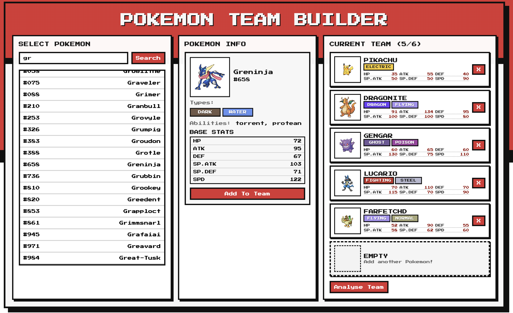
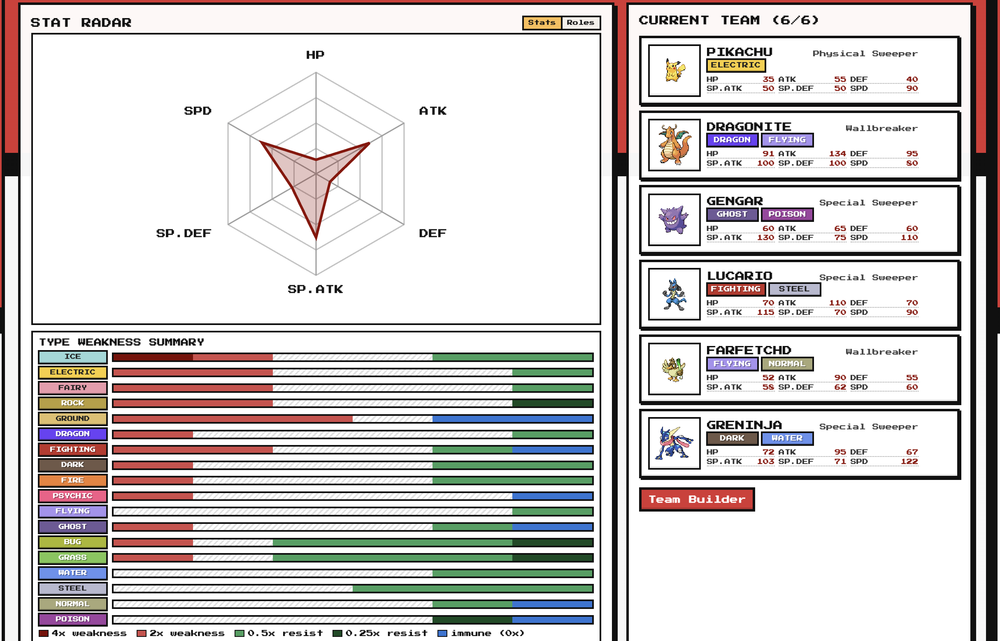
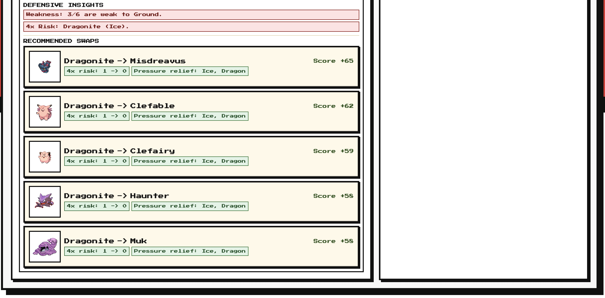

# Pokemon Team Builder

A simple Pokemon team builder with a Team Analysis page that shows role balance, defensive weaknesses, and suggested defensive swaps.

## Tech Stack

- Frontend: React + Vite
- Backend: Node.js + Express
- Data source: PokeAPI
- Styling: CSS

## APIs Used

External API:

- PokeAPI (`https://pokeapi.co/api/v2`)

Backend endpoints used by the frontend:

- `GET /api/pokemon?limit=&offset=`: list Pokemon
- `GET /api/pokemon/:nameOrId`: Pokemon details
- `POST /api/pokemon/team-defense-analysis`: type summary + defensive insights for the current team
- `POST /api/pokemon/defensive-swaps`: defensive swap recommendations

## Main Features

- Search and add Pokemon to a 6-member team
- View Pokemon details (types, abilities, base stats)
- Team Analysis page with:
  - stat/role radar
  - type weakness summary bars
  - defensive insight warnings
  - recommended defensive swaps

## Example Images

### Team Builder

### Team Analysis

### Team Recommendations

## Rough Calculation Logic

### Role Calculation (frontend)

Each Pokemon gets a score for 7 roles based on base stats (`HP`, `ATK`, `DEF`, `SP.ATK`, `SP.DEF`, `SPD`).
The highest score becomes that Pokemon's assigned role.

The table below is a rough guide to how each role is evaluated:

| Role             | Main traits (strong stats)                         | Usually weaker stats           | Purpose                                                  |
| ---------------- | -------------------------------------------------- | ------------------------------ | -------------------------------------------------------- |
| Physical Sweeper | High `ATK`, high `SPD`                             | `DEF`, `SP.DEF`                | Fast physical damage dealer that pressures teams early.  |
| Special Sweeper  | High `SP.ATK`, high `SPD`                          | `DEF`, sometimes `ATK`         | Fast special attacker that breaks from the special side. |
| Physical Wall    | High `DEF`, high `HP`                              | `SPD`, often `SP.ATK`          | Soaks physical hits and helps stabilize defense.         |
| Special Wall     | High `SP.DEF`, high `HP`                           | `SPD`, often `ATK`             | Soaks special hits and improves special matchup safety.  |
| Tank             | Balanced `HP`, `DEF`, `SP.DEF` with decent offense | Usually not very fast          | Takes hits while still threatening return damage.        |
| Wallbreaker      | Very high `ATK` or `SP.ATK` (raw power)            | Bulk and/or `SPD` can be lower | Breaks bulky opponents even without top speed.           |
| Fast Support     | High `SPD` with usable bulk/utility profile        | Raw attacking stats            | Moves first to provide utility and tempo support.        |

Team role radar is then built from all assigned roles and role-score distribution across the team.

### Recommended Defensive Swaps (backend)

For each team slot, the backend simulates replacing that Pokemon with candidate Pokemon and compares before/after defensive metrics.

The recommendation score mainly rewards:

- fewer severe shared weaknesses
- fewer uncovered attacking types
- fewer 4x-risk members
- lower weighted overall weakness pressure

If swaps tie on defensive improvement, average base stat gain (new Pokemon minus old Pokemon) is used to break ties, and now also contributes a small amount to the final score.

## Run Locally

From the project root:

1. `npm install`
2. `npm run dev`

This starts frontend and backend for local development.
