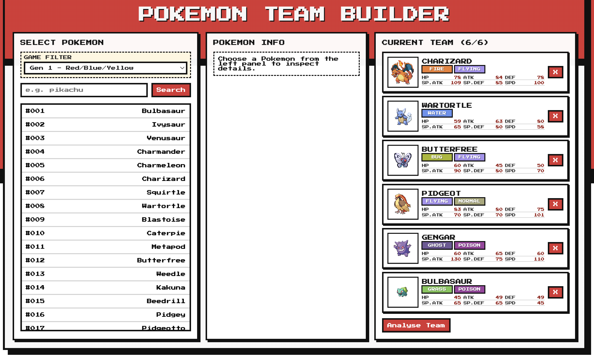
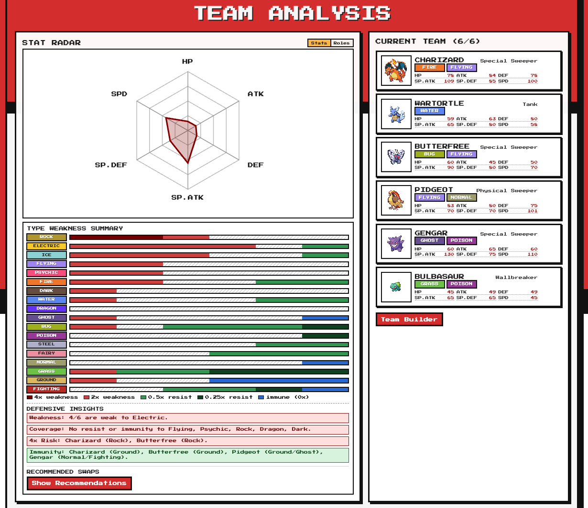
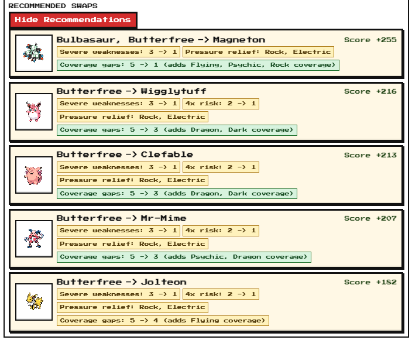

# Pokemon Team Builder

A casual-playthrough Pokemon team builder meant for players progressing through the main games, with a Team Analysis page that highlights role balance, defensive weaknesses, and suggested defensive swaps (not competitive meta optimisation).

## Tech Stack

- Frontend: React + Vite
- Backend: Node.js + Express
- Data source: PokeAPI
- Styling: CSS

## APIs Used

External API:

- PokeAPI (`https://pokeapi.co/api/v2`)

Backend endpoints used by the frontend:

- `GET /api/pokemon?limit=&offset=&gameFilterKey=`: list Pokemon (optionally scoped by selected game filter)
- `GET /api/pokemon/:nameOrId`: Pokemon details
- `GET /api/pokemon/:nameOrId/team-detail?gameFilterKey=`: enriched team-detail payload (evolution, moves, encounters, tooltips)
- `POST /api/pokemon/team-defense-analysis`: type summary + defensive insights for the current team
- `POST /api/pokemon/defensive-swaps`: defensive swap recommendations

## Main Features

- Search and add Pokemon to a 6-member team
- View Pokemon details (types, abilities, base stats)
- Filter Pokemon by game
- Team Analysis page with:
  - stat/role radar
  - type weakness summary bars
  - defensive insight warnings
  - recommended defensive swaps
- Team Detail page with:
  - click a Pokemon in Current Team (right panel) to load details on the left
  - click evolution entries to inspect that evolution target in the detail card
  - hover abilities to see tooltips with ability effects
  - expand move entries to see category, power, accuracy, PP, flavor text, and effect text
  - see encounter locations for selected game filter

## Game Filter Behavior

The Team Builder includes a **Game Filter** dropdown.

How it works:

1. If no game filter is selected (All Supported Games), the Select Pokemon list shows up to 50 Pokemon.
2. If a game filter is selected, the Select Pokemon list is filtered by Pokemon availability in that filter's games.
3. Availability is determined by PokeAPI Pokedex entries mapped through the selected filter's version groups.
4. The selected filter is saved in session storage and restored when you come back.

How it affects recommendations:

1. Defensive swap recommendations are generated from Pokemon available in the selected game filter.
2. If your current team contains Pokemon unavailable in the selected game filter, recommendations are blocked and an error is shown until the team/filter is fixed.

## Team Detail Page

The Team Detail page is designed to give you a breakdown of specific Pokemon on your current team.

How it works:

1. The first Pokemon is auto-selected when the page opens.
2. Clicking a team member on the right panel loads detailed information on the left.
3. Evolution entries are clickable; clicking one opens that target Pokemon in the detail card.
4. A back option appears after evolution navigation so you can return to the previous Pokemon.
5. Abilities are shown as chips with pixel-style hover tooltips for ability effects.
6. Move entries are expandable dropdown rows with level learnt, move name, plus:
   - category
   - power
   - accuracy
   - PP
   - flavor text and effect text
7. Move and encounter data are scoped to your selected game filter.
8. Evolution drilldown targets unavailable in the selected game filter show a clear unavailable message while keeping panel navigation usable.

## Example Images

### Team Builder

### Team Analysis

### Team Recommendations

## Rough Calculation Logic

### Role Calculation (frontend)

Each Pokemon gets a score for 7 roles based on base stats (`HP`, `ATK`, `DEF`, `SP.ATK`, `SP.DEF`, `SPD`).
The highest score becomes that Pokemon's assigned role.

The table below is a rough guide to how each role is evaluated:

| Role             | Main traits (strong stats)                         | Usually weaker stats           | Purpose                                                  |
| ---------------- | -------------------------------------------------- | ------------------------------ | -------------------------------------------------------- |
| Physical Sweeper | High `ATK`, high `SPD`                             | `DEF`, `SP.DEF`                | Fast physical damage dealer that pressures teams early.  |
| Special Sweeper  | High `SP.ATK`, high `SPD`                          | `DEF`, sometimes `ATK`         | Fast special attacker that breaks from the special side. |
| Physical Wall    | High `DEF`, high `HP`                              | `SPD`, often `SP.ATK`          | Soaks physical hits and helps stabilize defense.         |
| Special Wall     | High `SP.DEF`, high `HP`                           | `SPD`, often `ATK`             | Soaks special hits and improves special matchup safety.  |
| Tank             | Balanced `HP`, `DEF`, `SP.DEF` with decent offense | Usually not very fast          | Takes hits while still threatening return damage.        |
| Wallbreaker      | Very high `ATK` or `SP.ATK` (raw power)            | Bulk and/or `SPD` can be lower | Breaks bulky opponents even without top speed.           |
| Fast Support     | High `SPD` with usable bulk/utility profile        | Raw attacking stats            | Moves first to provide utility and tempo support.        |

Team role radar is then built from all assigned roles and role-score distribution across the team.

### Recommended Defensive Swaps (backend)

At a high level, the backend does this:

1. Finds your team's top weakness types.
2. Pulls a candidate pool from PokeAPI that can help cover those weaknesses.
3. Keeps only one Pokemon per evolution line in that pool (prefers the highest-stage evolution).
4. Simulates swaps for each team slot and scores each "old -> new" option.
5. Builds the final list with unique incoming Pokemon for the top recommendations.
   - If duplicate incoming targets appear while filling the top 5, they are merged into one entry (with multiple possible outgoing Pokemon).

The score rewards swaps that improve team defense, especially:

- fewer severe shared weaknesses
- fewer uncovered attacking types (no resist/immunity)
- fewer team members with 4x weaknesses
- lower overall weakness pressure across attacking types

Average base stat gain (new minus old) is a small bonus/tie-breaker, not the main driver.

## Run Locally

From the project root:

1. `npm install`
2. `npm run dev`

This starts frontend and backend for local development.
